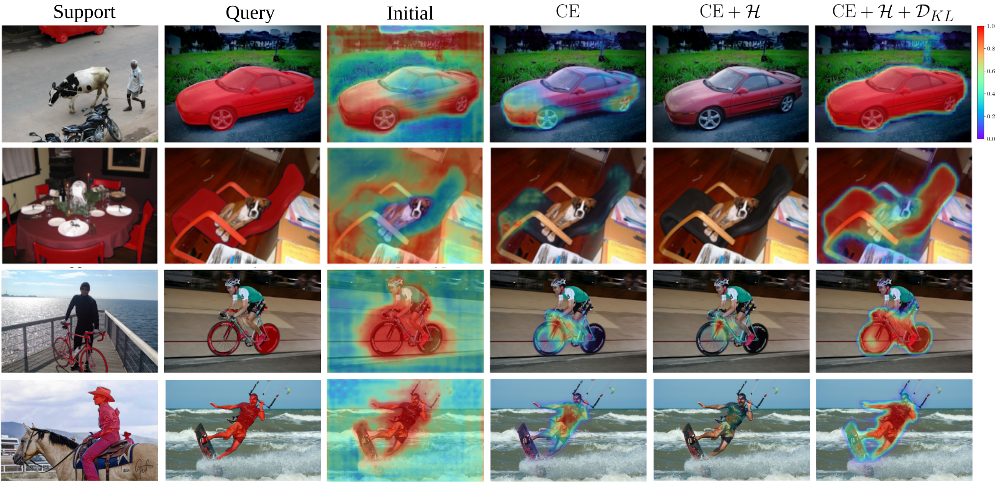
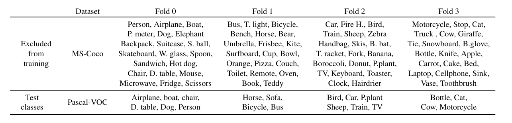

# Region Proportion Regularized Inference (RePRI) for Few-Shot Segmentation

Update 03/21: Paper accepted at CVPR 2021 !

Code for the paper : "Few-Shot Segmentation Without Meta-Learning: A Good Transductive Inference Is All You Need?", freely available at https://arxiv.org/abs/2012.06166:




## Getting Started

### Minimum requirements

1. Software :
+ torch==1.7.0
+ numpy==1.18.4
+ cv2==4.2.0
+ pyyaml==5.3.1

For both training and testing, metrics monitoring is done through **visdom_logger** (https://github.com/luizgh/visdom_logger). To install this package with pip, use the following command:

 ```
pip install git+https://github.com/luizgh/visdom_logger.git
 ```

 2. Hardware : A 11 GB+ CUDA-enabled GPU

### Download data

#### All pre-processed from Google Drive

We provide the versions of Pascal-VOC 2012 and MS-COCO 2017 used in this work at https://drive.google.com/file/d/1Lj-oBzBNUsAqA9y65BDrSQxirV8S15Rk/view?usp=sharing. You can download the full .zip and directly extract it at the root of this repo.

#### If the previous download failed

Here is the structure of the data folder for you to reproduce:

```
data
├── coco
│   ├── annotations
│   ├── train
│   ├── train2014
│   ├── val
│   └── val2014
└── pascal
|    ├── JPEGImages
|    └── SegmentationClassAug
```
**Pascal** : The JPEG images can be found in the PascalVOC 2012 toolkit to be downloaded at [PascalVOC2012](http://host.robots.ox.ac.uk/pascal/VOC/voc2012/VOCtrainval_11-May-2012.tar) and [SegmentationClassAug](https://mycuhk-my.sharepoint.com/personal/1155122171_link_cuhk_edu_hk/_layouts/15/onedrive.aspx?id=%2Fpersonal%2F1155122171%5Flink%5Fcuhk%5Fedu%5Fhk%2FDocuments%2FTPAMI%20Submission%2FPFENet%5Fcheckpoints%2Fgt%5Fvoc%2Ezip&parent=%2Fpersonal%2F1155122171%5Flink%5Fcuhk%5Fedu%5Fhk%2FDocuments%2FTPAMI%20Submission%2FPFENet%5Fcheckpoints&originalPath=aHR0cHM6Ly9teWN1aGstbXkuc2hhcmVwb2ludC5jb20vOnU6L2cvcGVyc29uYWwvMTE1NTEyMjE3MV9saW5rX2N1aGtfZWR1X2hrL0VSZ3lTb05ZYjdoQnF2REJFOHo0cVZzQmg2dTNLaVdOQllEWUJNZWcxemdFS0E_cnRpbWU9ZTVBTWNtdTgyRWc) (pre-processed ground-truth masks).

**Coco** : Coco 2014 train, validation images and annotations can be downloaded at [Coco](https://cocodataset.org/#download). Once this is done, you will have to generate the subfolders coco/train and coco/val (ground truth masks). Both folders can be generated by executing the python script data/coco/create_masks.py (note that the script uses the package pycocotools that can be found at https://github.com/cocodataset/cocoapi/tree/master/PythonAPI/pycocotools):

python
```
cd data/coco
python create_masks.py
 ```

#### About the train/val splits

The train/val splits are directly provided in lists/. How they were obtained is explained at https://github.com/Jia-Research-Lab/PFENet

### Download pre-trained models

#### Pre-trained backbones
First, you will need to download the ImageNet pre-trained backbones at https://drive.google.com/drive/folders/1Hrz1wOxOZm4nIIS7UMJeL79AQrdvpj6v and put them under initmodel/. These will be used if you decide to train your models from scratch.

#### Pre-trained models
We directly provide the full pre-trained models at https://drive.google.com/file/d/1iuMAo5cJ27oBdyDkUI0JyGIEH60Ln2zm/view?usp=sharing. You can download them and directly extract them at the root of this repo. This includes Resnet50 and Resnet101 backbones on Pascal-5i, and Resnet50 on Coco-20i.

## Overview of the repo

Data are located in data/. All the code is provided in src/. Default configuration files can be found in config_files/. Training and testing scripts are located in scripts/. Lists/ contains the train/validation splits for each dataset.


## Training (optional)

If you want to use the pre-trained models, this step is optional. Otherwise, you can train your own models from scratch with the scripts/train.sh script, as follows.

```python
bash scripts/train.sh {data} {fold} {[gpu_ids]} {layers}
```
For instance, if you want to train a Resnet50-based model on the fold-0 of Pascal-5i on GPU 1, use:
```python
bash scripts/train.sh pascal 0 [1] 50
```

Note that this code supports distributed training. If you want to train on multiple GPUs, you may simply replace [1] in the previous examples with the list of gpus_id you want to use.


## Testing

To test your models, use the scripts/test.sh script, the general synthax is:
```python
bash scripts/test.sh {data} {shot} {[gpu_ids]} {layers}
```
This script will test successively on all folds of the current dataset. Below are presented specific commands for several experiments.


### Pascal-5i

Results :
|(1 shot/5 shot)|   Arch     | Fold-0 	   | Fold-1 	 | Fold-2 	   | Fold-3      | Mean 		|
| 	   ---      |    ---     |      ---    |	   ---   |	   ---     |    ---      |  ---  		|
| RePRI       	| Resnet-50  | 60.2 / 64.5 | 67.0 / 70.8 | 61.7 / 71.7 | 47.5 / 60.3 | 59.1 / 66.8	|
| Oracle-RePRI	| Resnet-50  | 72.4 / 75.1 | 78.0 / 80.8 | 77.1 / 81.4 | 65.8 / 74.4 | 73.3 / 77.9  |
| RePRI       	| Resnet-101 | 59.6 / 66.2 | 68.3 / 71.4 | 62.2 / 67.0 | 47.2 / 57.7 | 59.4 / 65.6	|
| Oracle-RePRI	| Resnet-101 | 73.9 / 76.8 | 79.7 / 81.7 | 76.1 / 79.5 | 65.1 / 74.5 | 73.7 / 78.1  |

Command:
```python
bash scripts/test.sh pascal 1 [0] 50  # 1-shot
bash scripts/test.sh pascal 5 [0] 50  # 5-shot
```

### Coco-20i

Results :
|(1 shot/5 shot)|   Arch     | Fold-0 	   | Fold-1 	 | Fold-2 	   | Fold-3      | Mean 		|
| 	   ---      |    ---     |      ---    |	   ---   |	   ---     |    ---      |  ---			|
| RePRI       	| Resnet-50  | 31.2 / 38.5 | 38.1 / 46.2 | 33.3 / 40.0 | 33.0 / 43.6 | 34.0/42.1    |
| Oracle-RePRI	| Resnet-50  | 49.3 / 51.5 | 51.4 / 60.8 | 38.2 / 54.7 | 41.6 / 55.2 |	45.1 / 55.5 |

Command :
```python
bash scripts/test.sh coco 1 [0] 50  # 1-shot
bash scripts/test.sh coco 5 [0] 50  # 5-shot
```

### Coco-20i -> Pascal-VOC


The folds used for cross-domain experiments are presented in the image below:


Results :

|(1 shot/5 shot)|   Arch     | Fold-0 	   | Fold-1 	 | Fold-2 	   | Fold-3      | Mean 		|
| 	   ---      |    ---     |      ---    |	   ---   |	   ---     |    ---      |  --- 		|
| RePRI       	| Resnet-50  | 52.2 / 56.5 | 64.3 / 68.2 | 64.8 / 70.0 | 71.6 / 76.2 | 63.2 / 67.7  |
| Oracle-RePRI	| Resnet-50  | 69.6 / 73.5 | 71.7 / 74.9 | 77.6 / 82.2 | 86.2 / 88.1 | 76.2 / 79.7  |


Command :
```python
bash scripts/test.sh coco2pascal 1 [0] 50  # 1-shot
bash scripts/test.sh coco2pascal 5 [0] 50  # 5-shot
```


## Monitoring metrics

This code offers two options to visualize/plot metrics during training

### Live monitoring with visdom
For both training and testing, you can monitor metrics using visdom_logger (https://github.com/luizgh/visdom_logger). To install this package, simply clone the repo and install it with pip:
 ```
 git clone https://github.com/luizgh/visdom_logger.git
 pip install -e visdom_logger
 ```
 Then, you need to start a visdom server with:
 ```
 python -m visdom.server -port 8098
 ```
Finally, add the line visdom_port 8098 in the options in scripts/train.sh or scripts/test.sh, and metrics will be displayed at this port. You can monitor them through your navigator.

### Good old fashioned matplotlib

Alternatively, this code also saves important metrics (training loss, accuracy and validation loss and accuracy) as training progresses in the form of numpy files (.npy). Then, you can plot these metrics with:
```python
bash scripts/plot_training.sh model_ckpt
```

## Contact

For further questions or details, please post an issue or directly reach out to Malik Boudiaf (malik.boudiaf.1@etsmtl.net)


## Acknowledgments

We gratefully thank the authors of https://github.com/Jia-Research-Lab/PFENet, as well as https://github.com/hszhao/semseg from which some parts of our code are inspired.


